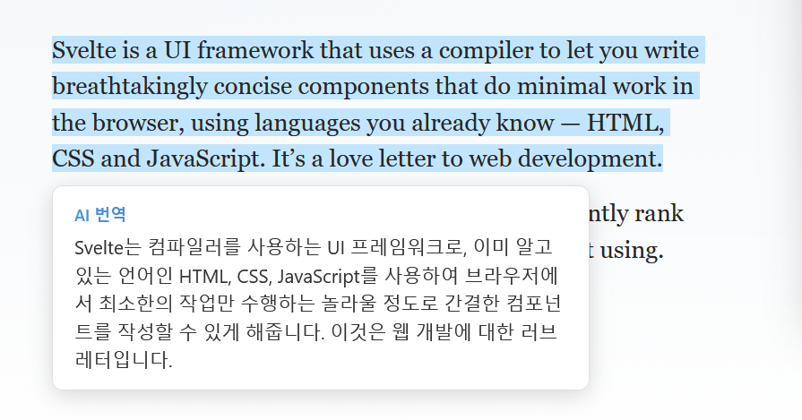
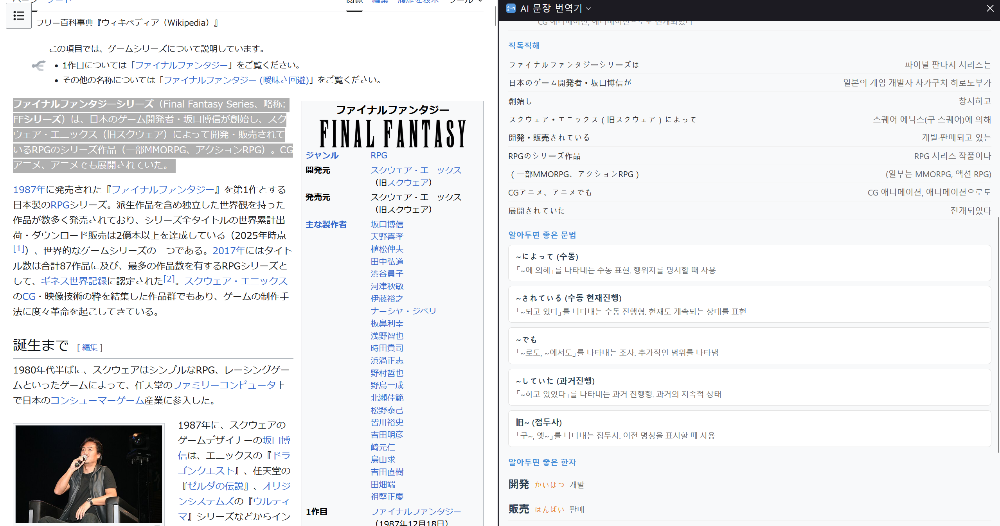

# AI Translator

Translate selected English/Japanese text to Korean instantly using Claude AI.

## Features

- 텍스트 드래그 후 우클릭 → **AI로 번역하기** 또는 `Ctrl+Shift+Y`로 즉시 번역
- 번역 결과를 선택한 텍스트 근처에 팝오버로 표시
- 우클릭 → **AI 문장 파헤치기**로 사이드바에서 상세 분석
  - 문장 구조, 직독직해, 문법 노트
  - 여러 문장 선택 시 문장별 개별 분석 가능

## Screenshots

